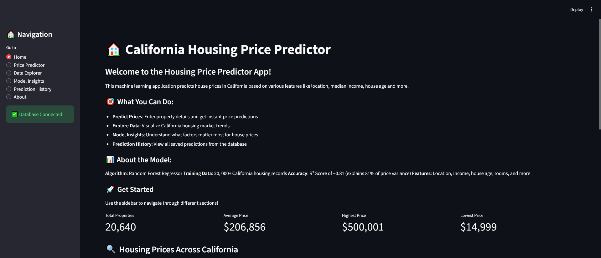
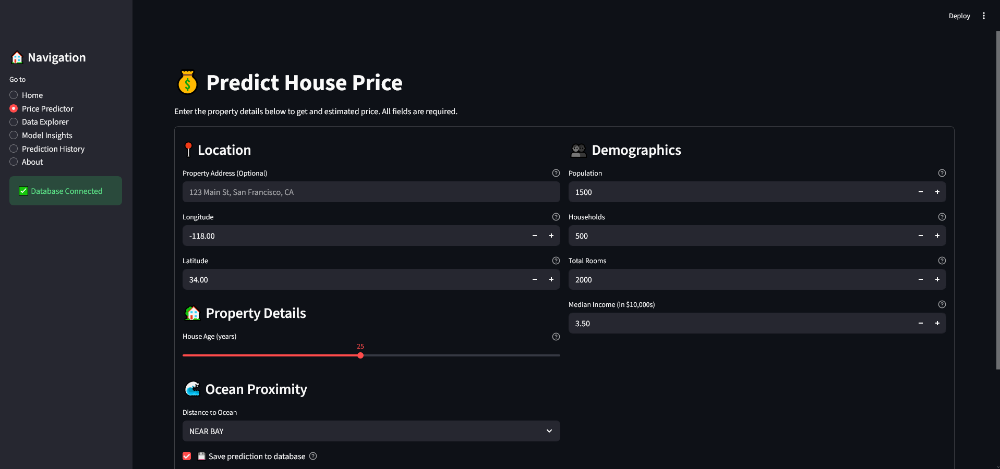
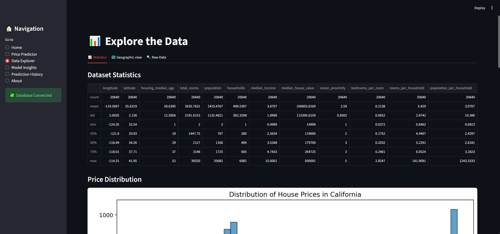

# 🏠 California Housing Price Predictor

## Overview

A full-stack machine learning web application that predicts California housing prices using Random Forest regression. This interactive Streamlit app allows users to explore housing data, make price predictions, view model insights, and track prediction history through a PostgreSQL database.

## Problem Statement

Real estate pricing is complex and influenced by numerous factors including location, demographics, and property characteristics. This project aims to provide accurate housing price predictions in California by analyzing historical census data and applying machine learning techniques. The tool helps homebuyers, sellers, and real estate professionals make data-driven decisions.

## Dataset

- **Source**: [California Housing Prices - Kaggle](https://www.kaggle.com/datasets/camnugent/california-housing-prices)
- **Size**: 20,640 rows, 10 columns
- **Origin**: 1990 California census data
- **Features**:
  - **Geographic**: Longitude, Latitude, Ocean Proximity
  - **Property**: Housing Median Age, Total Rooms, Total Bedrooms
  - **Demographics**: Population, Households, Median Income
  - **Target**: Median House Value

## Tech Stack

- **Python 3.13.2** - Core programming language
- **pandas 2.3.3** - Data manipulation and analysis
- **numpy 2.3.5** - Numerical computing
- **scikit-learn 1.8.0** - Machine learning modeling
- **matplotlib 3.10.8** - Data visualization
- **seaborn 0.13.2** - Statistical data visualization
- **Streamlit 1.52.0** - Interactive web application framework
- **Plotly 6.5.0** - Interactive geographic visualizations
- **PostgreSQL** - Relational database for predictions storage
- **psycopg2-binary 2.9.11** - PostgreSQL adapter
- **python-dotenv 1.2.1** - Environment variable management

## Project Structure

```
house-price-predictor/
│
├── notebooks/
│   ├── .ipynb_checkpoints/
│   ├── 01_data_cleaning.ipynb
│   ├── 02_exploratory_data_analysis.ipynb
│   └── 03_model_building.ipynb
│
├── src/
│   ├── __pycache__/
│   ├── app.py                    # Main Streamlit application
│   ├── database.py               # PostgreSQL database operations
│   ├── pages.py                  # Page components and layouts
│   ├── predictor.py              # Model prediction logic
│   ├── styles.py                 # CSS styling and configurations
│   └── visualizations.py         # Plotting and charting functions
│
├── models/
│   └── housing_price_model.pkl   # Trained Random Forest model
│
├── data/
│   ├── housing.csv               # Raw dataset
│   └── housing_cleaned.csv       # Processed dataset
│
├── scripts/
│   ├── setup_database.py         # Database initialization
│   └── test_database.py          # Database connection testing
│
├── sql/
│   └── schema.sql                # Database schema (optional)
│
├── .env                          # Environment variables (not in repo)
├── .gitignore
├── requirements.txt
└── README.md
```

## Key Features

### 🔮 Interactive Price Predictions
- Input property details (location, age, rooms, income, ocean proximity)
- Get instant price predictions with 95% confidence intervals
- Save predictions to PostgreSQL database for tracking
- Visual comparison with market distribution

### 📊 Data Exploration
- Interactive statistics dashboard
- Correlation heatmaps
- Geographic price mapping with Plotly
- Download raw data as CSV

### 🔬 Model Insights
- Feature importance visualization
- Model performance metrics (R², MAE, RMSE)
- Understanding of price drivers

### 📜 Prediction History
- View all saved predictions from database
- Track model performance over time
- Export historical data

### 🎨 User Experience
- Clean, modern UI with custom CSS
- Mobile-responsive design
- Real-time database status monitoring
- Comprehensive navigation system

## Machine Learning Model

### Algorithm: Random Forest Regressor

**Why Random Forest?**
- Handles non-linear relationships between features
- Robust to outliers and missing data
- Provides feature importance rankings
- Less prone to overfitting than single decision trees
- No need for feature scaling

### Feature Engineering
- `bedrooms_per_room`: Ratio of bedrooms to total rooms
- `rooms_per_household`: Average rooms per household
- `population_per_household`: Average household size
- One-hot encoding for ocean proximity categories

## Results

### Model Performance
- **R² Score**: 0.81 (explains 81% of price variance)
- **Mean Absolute Error**: ~$49,000
- **Training Set**: 16,512 properties (80%)
- **Test Set**: 4,128 properties (20%)

### Key Insights
- **Median Income** is the strongest predictor of house prices (highest feature importance)
- **Geographic location** (latitude/longitude) significantly impacts pricing
- **Ocean proximity** adds substantial value, especially "NEAR BAY" and "<1H OCEAN"
- **Property age** has moderate impact, with newer homes commanding higher prices
- **Population density** (rooms and people per household) influences pricing

### Feature Importance Rankings
1. Median Income (~45%)
2. Longitude (~15%)
3. Latitude (~12%)
4. Ocean Proximity (~10%)
5. Housing Median Age (~8%)
6. Other features (~10%)

## How to Run

### Prerequisites
- Python 3.13+
- PostgreSQL database (optional, for prediction history)

### Installation

1. **Clone the repository**
```bash
git clone https://github.com/V1CTAL/house-price-predictor.git
cd house-price-predictor
```

2. **Create virtual environment**
```bash
python -m venv venv
source venv/bin/activate  # On Windows: venv\Scripts\activate
```

3. **Install dependencies**
```bash
pip install -r requirements.txt
```

4. **Set up environment variables** (optional for database)
Create a `.env` file in the root directory:
```env
DB_NAME=housing_db
DB_USER=housing_user
DB_PASSWORD=your_password
DB_HOST=localhost
DB_PORT=5432
```

5. **Initialize database** (optional)
```bash
python scripts/setup_database.py
```

6. **Run the application**
```bash
streamlit run src/app.py
```

7. **Open in browser**
The app will automatically open at `http://localhost:8501`

## Usage Guide

### Making Predictions
1. Navigate to **Price Predictor** page
2. Enter property details:
   - Location coordinates (latitude/longitude)
   - Property characteristics (age, rooms)
   - Demographics (population, households, median income)
   - Ocean proximity category
3. Click **🔮 Predict Price**
4. View predicted price with confidence interval
5. Optionally save to database

### Exploring Data
1. Go to **Data Explorer** page
2. View statistics, correlations, and geographic distributions
3. Download dataset for further analysis

### Understanding the Model
1. Visit **Model Insights** page
2. See which features matter most
3. Review model performance metrics

## Database Schema

```sql
-- Properties table
CREATE TABLE properties (
    property_id SERIAL PRIMARY KEY,
    address VARCHAR(255),
    bedrooms INT,
    bathrooms DECIMAL,
    square_feet INT,
    lot_size INT,
    year_built INT,
    zip_code VARCHAR(10),
    latitude DECIMAL,
    longitude DECIMAL,
    actual_price DECIMAL
);

-- Predictions table
CREATE TABLE predictions (
    prediction_id SERIAL PRIMARY KEY,
    property_id INT REFERENCES properties(property_id),
    predicted_price DECIMAL,
    prediction_date TIMESTAMP DEFAULT CURRENT_TIMESTAMP,
    model_version VARCHAR(50),
    confidence_score DECIMAL
);
```

### Future Improvements

**Model Enhancements**
- [ ] Implement XGBoost and compare performance
- [ ] Add neural network models for comparison
- [ ] Incorporate time-series analysis for price trends
- [ ] Include more recent housing data (post-1990)

**Application Improvements**
- [ ] A/B testing for model comparison
- [ ] RESTful API for external integrations
- [ ] Automated model retraining pipeline
- [ ] PDF report generation for predictions

**Technical Upgrades**
- [ ] Docker containerization
- [ ] Cloud deployment (AWS/GCP/Azure)

## Screenshots

### Home Page

*Main dashboard with quick statistics and price distribution*

### Price Predictor

*Interactive form for entering property details and getting predictions*

### Data Explorer

*Interactive map showing housing prices across California*

### Model Insights

*Feature importance and model performance metrics*

## Contributing

Contributions are welcome! Please feel free to submit a Pull Request.

1. Fork the repository
2. Create your feature branch (`git checkout -b feature/AmazingFeature`)
3. Commit your changes (`git commit -m 'Add some AmazingFeature'`)
4. Push to the branch (`git push origin feature/AmazingFeature`)
5. Open a Pull Request

## License

This project is licensed under the MIT License - see the LICENSE.md file for details.

## Author

**Victal**
- GitHub: [@V1CTAL](https://github.com/V1CTAL)
- LinkedIn: [Your LinkedIn](your-linkedin-url)

## Acknowledgments

- Dataset provided by [Kaggle - California Housing Prices](https://www.kaggle.com/datasets/camnugent/california-housing-prices)
- Original data from the 1990 California census
- Inspired by the classic Scikit-learn California Housing dataset
- Built with ❤️ using Streamlit

---

⭐ If you found this project helpful, please consider giving it a star!